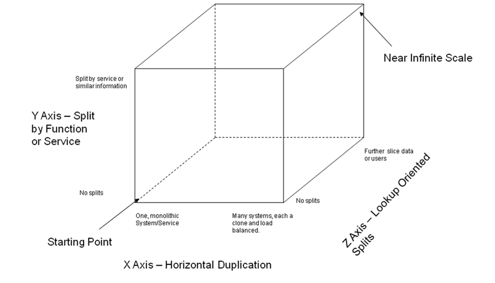

# Economies of Scaling Software Ideas

## What's In the Abstract
Topics covered include: parallelism, load distribution, state management, caching, big data, asynchronous processing, and static content delivery. Leveraging cloud computing, scaling teams and DevOps will also be discuss. P.S. This session is more technical than you might think.

* cloud computing (12 factor apps, microservices)
* asynchronous processing (AMPQ? WS? )
* big-data
* caching (Spring Cache, Memcached (Hazelcast, Couchbase, Redis))
* load distribution (move to the backend : RabbitMQ )
* state management (Spring Session, Spring Data, Spring Cache abstraction)

## Why Do We Scale?
 - Moore's law no longer works
 - systems are increasingly complex
 - mobile?
 - social?
 - Chris Richardson wrote a very nice http://www.infoq.com/articles/microservices-intro[introduction to scaling services using microservices]. In the article (and in his previous _Decomposing Applications for Scalability_) in which he http://akfpartners.com/techblog/2008/05/08/splitting-applications-or-services-for-scale/[introduces the scale cube]. This is the scale cube:
+

## Z-axis scaling: introduce data-partitionability.
 - Obviously: start with where all the state is! Data tier. This one is free. Easier, too.
 - *NoSQL*: _CAP_ theorem. Many datastores provide some of the following three characteristics: consistency, availability, partitionability. You can't have more than two of the three in the constraint.
  ** *clarification #1*: in a system with no network partitions (such as a single-node RDBMS), then there's no need to sacrifice C & A.
  ** *clarification #2*: availability is a continuous value: 0-100%. there are many levels of consistency, and even partitions have nuances, including disagreement within the system about whether a partition exists.
 - slice data sets through sharding, or just domain. this has the side effect of makign it easy to choose the right data-set
 - using NoSQL stores like MongoDB, Couchbase, Cassandra
 - DEMO: Spring Data makes it easy to connect to the wide world of different data-stores. Common tech like repositories.
 - DEMO: Spring Data provides best-of-breed support for working with

## Y-axis scaling: break the functionality apart into bounded contexts.
 - SRP - the single responsibility principle.
 - Adrian Cochroft's "SOA with a bounded context"
 - natural fit for microservices. Build the smallest thing that could work.
 - look a Spring Boot for building up operations-friendly services. Look how little code there is. there's no reason to avoid this exercise. it's not like you gain in convenience.
 - does this teasing apart introduce complexity? Yes. but Spring Cloud provides tools to cope.
  ** independant deployability gives you the ability to use the right language, toolset, for the job. Obviously, our hope is that this remains Spring on the JVM
  ** pains of teasing services apart
  *** DEMO: 2 small microservices
  *** DEMO: service discovery using Eureka
  *** DEMO: distributed versioning configuration
  *** DEMO: refreshabiity (maybe get the event bus up and running?)
  *** communications: move to messaging centric (and reactive) IO. communication between systems using AMQP.
  *** scaling operations integration (with things like `/metrics`, `/health`, etc.)
  ** a PaaS makes it dead simple to quickly deploy a complex system, consistently across environments.
  ** http://run.pivotal.io/[Cloud Foundry], for example, provides `manifest.yml` files.

##  X-axis scaling: horizontal duplication

 - building apps that scale is easy without application-local state. Keep processing request and response centric. It's cheap with Spring Security to hydrate security sessions by putting cache-friendly authentication lookups in front of a data cache.
 - load balancing is easy (esp. once you've removed state)
 - middleware is an effective way of distributing load among multiple consumers.
 - make the case for PaaS as a way to build dynamic architectures
 - DEMO: Cloud Foundry's ability to scale up easily.
 - what about if you have *some* (such as with security) state? Use Spring Session!
 - DEMO: microservices with SSO using HTTP session (via Spring Session) to communicate securely.

## More on Caching
 - there are lots of places you can insert this in an application. I think that Spring Cache is often the right granularity: service-tier granularity.
 - Spring Cache offers many integrations including a JSR 107 implementation.
